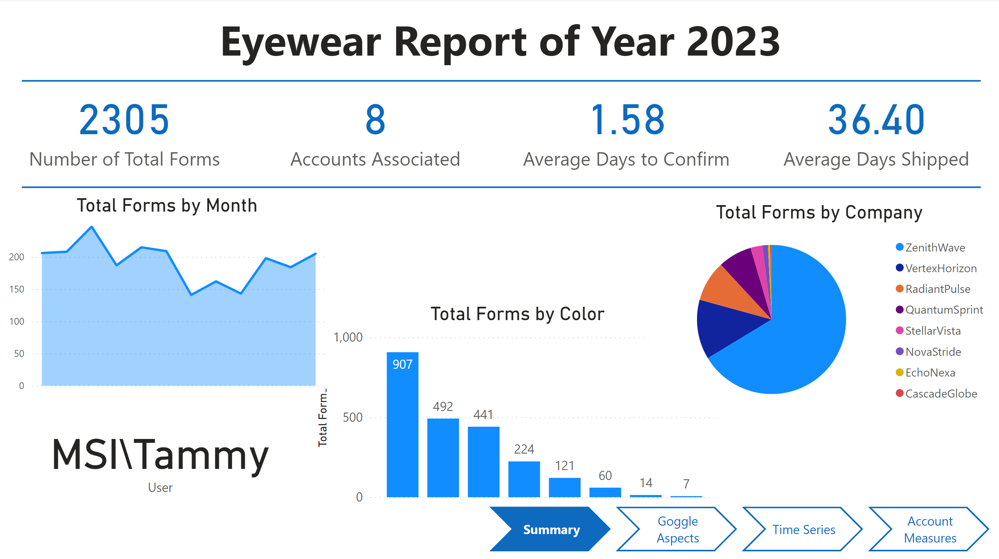

<!-- Heading -->
<div align="center">
  
  <h1 align="center">Power BI TLDP X MTA Program</h1>

  <p align="center">
    A two-week winter project aimed to showcase the capabilities of Power BI.
    <br />
    
  </p>
</div>


## Description
This project is created over a two-week period as an outcome of the TLDP X MTA Remote Internship Program from Baruch College, collaborated with the Metropolitan Transportation Authority (MTA).The repository includes the original data in an Excel worksheet, a Python script for data cleaning, and the Power BI dashboard file (.pbix).

This project is dedicated to showcasing the potential of Power BI in data transformation through data cleaning and creating insightful dashboard reports. A sample dataset from a fictional goggle company called POG is used for the analysis, focusing on order forms for goggles. The dataset includes information such as size, color, frame, order confirmation date, delivery date, client company ID, delivery status, and a unique form number.

This program is designed to assist students enrolled in the Technology Leadership Development Program (TLDP) at CUNY Baruch College, which is a leadership development program that are meant for student with an interest in technology-related fields to get a hand-on experience for career development.

## Getting Started
To get started with this project, follow these steps:

1. Clone the repository to your local machine:
   ```sh
   git clone https://github.com/Muji8226/powerbi_mta_program.git
   ```
2. Explore the raw dataset in the Eyewear Tracking File Data-Year 2023.xlsx. The account_name.xlsx file is a small dataset that stores a list of AI-generated acount names for readability, not part of the initial dataset.
3. View the visualizations of the cleaned dataset on the Power BI dashboard file eyewear_report.pbix.


### Built With
* 
* 


## Dependencies
* Power BI Desktop
* Python 3.x
* pandas, random, numpy, datetime packages

## Contact
Mujie Shen - [GitHub](https://github.com/Muji8226) - [LinkedIn](http://www.linkedin.com/in/mujie-shen/)

## Acknowledgement
* [Img Shields](https://shields.io)
